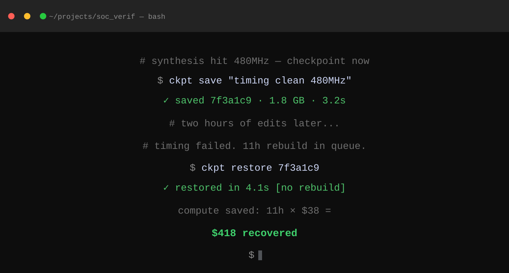

# ckpt

Dead-simple CLI checkpoint and rollback tool for EDA projects.

Save your entire project state with one command, then roll back to it in seconds — no recompute, no queue. Think of it as a snapshot tool for multi-gigabyte EDA / simulation workspaces: a content-addressed store (**`.ckpt/`**) deduplicates files, so repeated saves only write what actually changed.



## Features

- **`save` / `restore` / `list` / `diff`** — full-project checkpoints without touching your files
- **Content-addressed dedup** — identical files are stored once, whatever the checkpoint
- **Tags** — mark golden states (`ckpt tag <id> golden`) and filter with `ckpt list --tag golden`
- **Export** — dump any checkpoint to a portable `tar.gz`
- **`delete` + `gc`** — reclaim disk space by pruning old checkpoints and unreferenced objects
- **Built-in ignore rules** for Vivado, Quartus, ModelSim and common junk (`.log`, `*.jou`, `db/`, `work/`, `__pycache__/`, …) plus a `.ckptignore` for your own patterns
- Single binary — no Python needed on the target machine

## Install

**Requirements:** Python 3.10+ (only for source/build installs). Supported platforms: Linux (x86_64), macOS (arm64), Windows (WSL2).

### From source

```sh
git clone https://github.com/sankarnarayanansr/ckpt.git
cd ckpt
pip install .
```

This installs the `ckpt` command. Verify with `ckpt --version`.

### Prebuilt binary

A prebuilt macOS (Apple Silicon) binary is included in `dist/`:

```sh
chmod +x dist/ckpt-darwin-arm64
sudo mv dist/ckpt-darwin-arm64 /usr/local/bin/ckpt
ckpt --version
```

### Build your own binary

Requires [PyInstaller](https://pyinstaller.org/):

```sh
./build.sh
# -> dist/ckpt-<os>-<arch>
```

Pushing a tag like `v1.0.0` also triggers the GitHub Actions workflow, which builds binaries for Linux, macOS and Windows and attaches them to a GitHub release.

## Usage

Run all commands from your project directory (or pass `--root <dir>`).

### Save a checkpoint

```sh
ckpt save "timing clean 480MHz"
```

Hashes every file (honouring `.ckptignore` + defaults), stores new objects in `.ckpt/objects/`, and prints a short ID.

### List checkpoints

```sh
ckpt list
ckpt list --limit 5
ckpt list --tag golden
```

```
7f3a1c9   2024-01-15 14:32   timing clean 480MHz       1.8 GB
3bc9d12   2024-01-15 09:11   pre-constraint tweak       1.7 GB
a1f0023   2024-01-14 22:44   baseline                   1.6 GB
```

### Restore a checkpoint

```sh
ckpt restore 7f3a1c9
ckpt restore 7f3a1c9 --dry-run   # show what would change, restore nothing
```

Restores your project to that exact state in seconds.

### Diff two checkpoints

```sh
ckpt diff 3bc9d12 7f3a1c9
```

Shows exactly which files were added, removed or modified between any two saved states.

### Tag a checkpoint

```sh
ckpt tag 7f3a1c9 golden
ckpt tag 7f3a1c9 golden --remove
```

### Export a checkpoint as tar.gz

```sh
ckpt export 7f3a1c9 golden-state.tar.gz
```

Useful for sharing a reproducible state or attaching data to a paper.

### Delete checkpoints and reclaim space

```sh
ckpt delete 3bc9d12          # delete one checkpoint (objects stay until gc)
ckpt delete --all --yes      # delete every checkpoint
ckpt gc                      # remove objects no longer referenced by any checkpoint
ckpt gc --dry-run            # see how much would be freed
```

## Ignoring files

Default ignore rules already cover common EDA build byproducts. To add your own, create a `.ckptignore` in the project root (same syntax as `.gitignore`):

```
*.log
*.tmp
sim_work/
__pycache__/
.Xil/
```

The store itself (`.ckpt/`) is always skipped.

## Custom store location

By default every project keeps its store in `<project>/.ckpt/`. Point `save` at a shared NAS so your whole team shares one rollback history:

```sh
ckpt save "post-synth" --store-path /mnt/nas/projects/soc_verif/.ckpt/objects
```

## Automating saves via TCL

Add this to your synthesis TCL script to auto-checkpoint at key milestones:

```tcl
exec ckpt save "post-synth [get_property SLACK [get_timing_paths]]"
```

## How it works

- Every file is SHA-256 hashed and stored content-addressed at `.ckpt/objects/<xx>/<rest-of-hash>`, so unchanged files across checkpoints are stored only once.
- A checkpoint is a small manifest under `.ckpt/` recording the message, timestamp, tags and the `path -> hash` list of every file at save time.
- `restore` copies each manifest entry back into the project tree.
- `ckpt gc` deletes any object not referenced by a live checkpoint.

## Development

```sh
pip install -e .
pip install pytest
pytest tests/
```

## Uninstall

```sh
sudo rm /usr/local/bin/ckpt   # or: pip uninstall ckpt
rm -rf .ckpt                  # remove the local store for a project
```

## Troubleshooting

**`command not found` after install** — `/usr/local/bin` may not be on `PATH`:

```sh
export PATH="/usr/local/bin:$PATH"
```

**Binary permission denied**

```sh
chmod +x /usr/local/bin/ckpt
```

**macOS — "cannot be opened because the developer cannot be verified"**

```sh
xattr -d com.apple.quarantine /usr/local/bin/ckpt
```

## License

MIT
